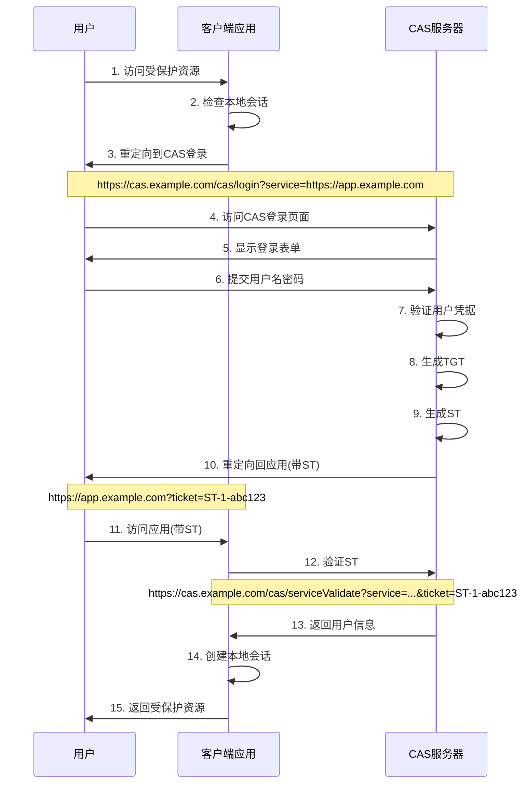
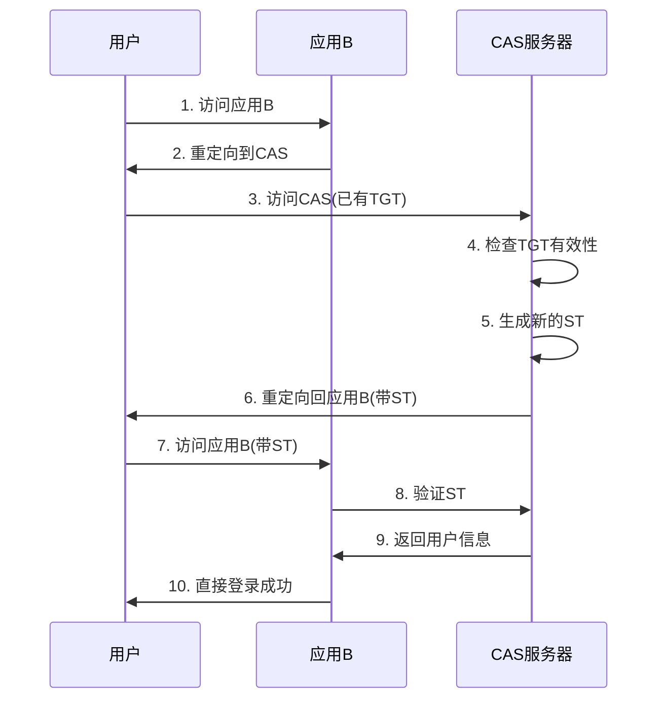
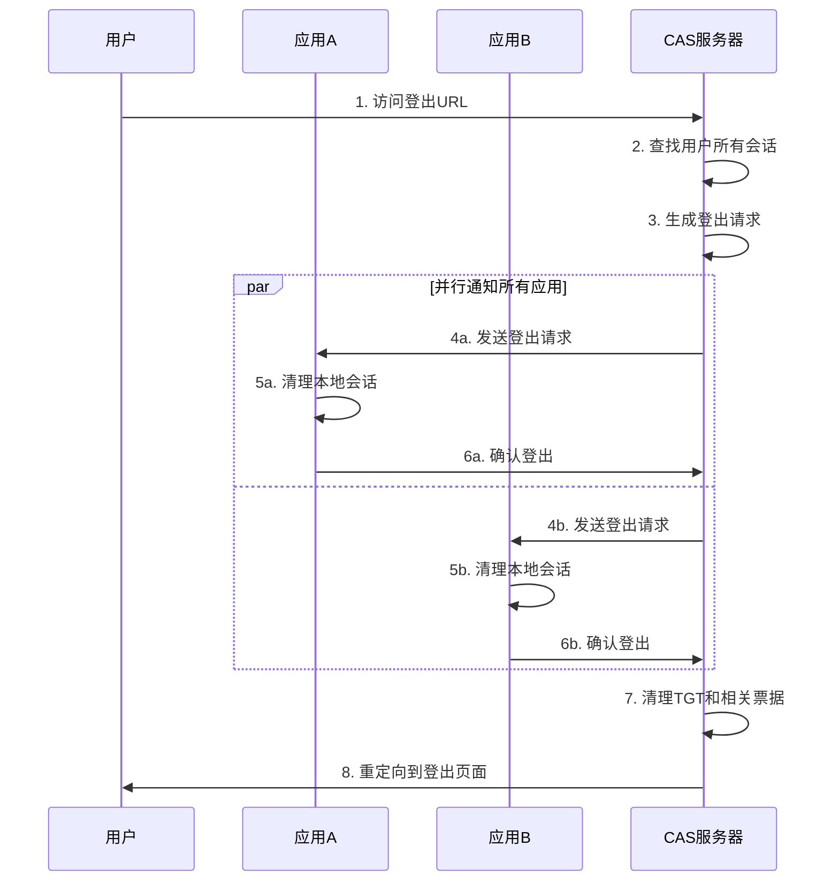
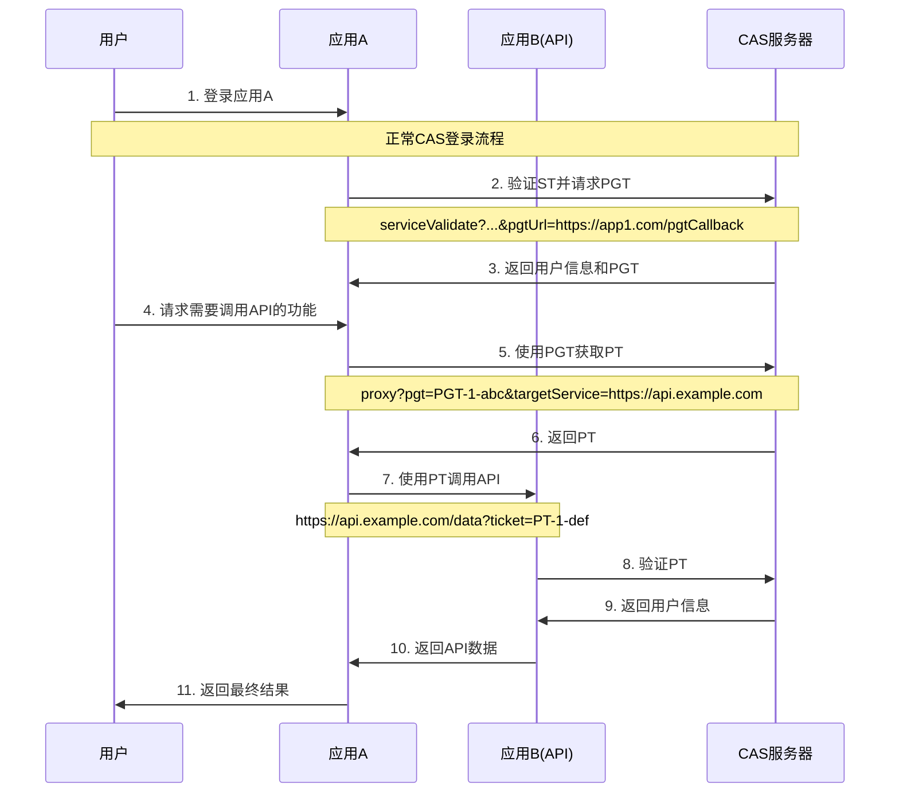

# CAS 协议详细指南

## 概述

CAS (Central Authentication Service) 是一个单点登录协议，允许用户通过一次认证访问多个应用系统。本文档详细说明了 CAS 协议的工作原理和实现细节。

## CAS 协议版本

### CAS 1.0
- 最基础的 CAS 协议版本
- 仅支持简单的票据验证
- 返回纯文本格式的响应
- 不支持属性传递

### CAS 2.0
- 引入 XML 格式的响应
- 支持用户属性传递
- 增加代理认证功能
- 支持单点登出

### CAS 3.0
- 扩展的属性支持
- 增强的代理功能
- 更好的错误处理
- 向后兼容 CAS 2.0

## 核心概念

### 票据类型

#### 1. TGT (Ticket Granting Ticket)
- **用途**: 票据授予票据，用于 SSO 会话管理
- **生命周期**: 通常 2-8 小时
- **存储位置**: CAS 服务器端
- **格式**: `TGT-{序号}-{随机字符串}-{时间戳}`

```php
// TGT 生成示例
$tgt = 'TGT-1-' . Str::random(32) . '-' . time();
```

#### 2. ST (Service Ticket)
- **用途**: 服务票据，用于单次服务认证
- **生命周期**: 通常 5 分钟
- **使用次数**: 仅能使用一次
- **格式**: `ST-{序号}-{随机字符串}-{时间戳}`

```php
// ST 生成示例
$st = 'ST-1-' . Str::random(32) . '-' . time();
```

#### 3. PT (Proxy Ticket)
- **用途**: 代理票据，用于代理认证
- **生命周期**: 通常 5 分钟
- **使用场景**: 应用 A 代表用户访问应用 B
- **格式**: `PT-{序号}-{随机字符串}-{时间戳}`

#### 4. PGT (Proxy Granting Ticket)
- **用途**: 代理授予票据，用于生成 PT
- **生命周期**: 与 TGT 相同
- **格式**: `PGT-{序号}-{随机字符串}-{时间戳}`

### 关键组件

#### CAS 服务器
- 中央认证服务器
- 负责用户认证和票据管理
- 提供登录/登出界面
- 处理票据验证请求

#### CAS 客户端
- 集成 CAS 协议的应用系统
- 重定向用户到 CAS 服务器
- 验证从 CAS 服务器返回的票据
- 处理单点登出请求

## 详细流程

### 1. 首次登录流程



### 2. 已登录用户访问新应用



### 3. 单点登出流程



### 4. 代理认证流程



## 安全考虑

### 1. 票据安全

#### 票据生成
```php
// 使用加密安全的随机数生成器
$randomBytes = random_bytes(32);
$ticket = 'ST-' . bin2hex($randomBytes);

// 添加时间戳和校验
$timestamp = time();
$checksum = hash_hmac('sha256', $ticket . $timestamp, config('app.key'));
$finalTicket = $ticket . '-' . $timestamp . '-' . substr($checksum, 0, 8);
```

#### 票据验证
```php
// 验证票据格式
if (!preg_match('/^ST-[a-f0-9]{64}-\d{10}-[a-f0-9]{8}$/', $ticket)) {
    throw new InvalidTicketException('Invalid ticket format');
}

// 验证时间戳
$parts = explode('-', $ticket);
$timestamp = $parts[2];
if (time() - $timestamp > config('casserver.ticket.st_lifetime')) {
    throw new TicketExpiredException('Ticket expired');
}

// 验证校验和
$expectedChecksum = hash_hmac('sha256', $parts[0] . '-' . $parts[1] . '-' . $timestamp, config('app.key'));
if (!hash_equals(substr($expectedChecksum, 0, 8), $parts[3])) {
    throw new InvalidTicketException('Invalid ticket checksum');
}
```

### 2. 服务验证

```php
// 验证服务URL是否在白名单中
class ServiceValidator
{
    public function validateService(string $service): bool
    {
        $client = Client::where('service_url', $service)
                       ->where('enabled', true)
                       ->first();
        
        if (!$client) {
            Log::warning('Unauthorized service access attempt', [
                'service' => $service,
                'ip' => request()->ip()
            ]);
            return false;
        }
        
        return true;
    }
}
```

### 3. 会话安全

```php
// 会话固定攻击防护
session_regenerate_id(true);

// 设置安全的会话配置
ini_set('session.cookie_httponly', 1);
ini_set('session.cookie_secure', 1);
ini_set('session.use_strict_mode', 1);
```

## 错误处理

### CAS 1.0 错误响应
```
no\n\n
```

### CAS 2.0/3.0 错误响应
```xml
<cas:serviceResponse xmlns:cas='http://www.yale.edu/tp/cas'>
    <cas:authenticationFailure code="INVALID_TICKET">
        票据无效或已过期
    </cas:authenticationFailure>
</cas:serviceResponse>
```

### 常见错误代码

| 错误代码 | 说明 | 处理方式 |
|---------|------|----------|
| INVALID_REQUEST | 请求参数无效 | 检查必需参数 |
| INVALID_TICKET | 票据无效 | 重新获取票据 |
| INVALID_SERVICE | 服务未授权 | 检查服务注册 |
| INTERNAL_ERROR | 内部错误 | 检查服务器日志 |

## 性能优化

### 1. 票据存储优化

```php
// 使用 Redis 存储票据
class RedisTicketStorage
{
    public function store(string $ticket, array $data, int $ttl): void
    {
        Redis::setex("cas:ticket:{$ticket}", $ttl, json_encode($data));
    }
    
    public function retrieve(string $ticket): ?array
    {
        $data = Redis::get("cas:ticket:{$ticket}");
        return $data ? json_decode($data, true) : null;
    }
    
    public function delete(string $ticket): void
    {
        Redis::del("cas:ticket:{$ticket}");
    }
}
```

### 2. 数据库优化

```sql
-- 为票据表添加索引
CREATE INDEX idx_tickets_ticket ON cas_tickets(ticket);
CREATE INDEX idx_tickets_user_id ON cas_tickets(user_id);
CREATE INDEX idx_tickets_created_at ON cas_tickets(created_at);
CREATE INDEX idx_tickets_expires_at ON cas_tickets(expires_at);

-- 定期清理过期票据
DELETE FROM cas_tickets WHERE expires_at < NOW();
```

### 3. 缓存策略

```php
// 缓存用户属性
class UserAttributeCache
{
    public function getUserAttributes(int $userId): array
    {
        return Cache::remember("cas:user_attrs:{$userId}", 3600, function () use ($userId) {
            return User::find($userId)->getAttributes();
        });
    }
}

// 缓存客户端信息
class ClientCache
{
    public function getClient(string $serviceUrl): ?Client
    {
        return Cache::remember("cas:client:{$serviceUrl}", 1800, function () use ($serviceUrl) {
            return Client::where('service_url', $serviceUrl)->first();
        });
    }
}
```

## 监控和日志

### 1. 关键指标监控

```php
// 监控票据生成速率
class TicketMetrics
{
    public function recordTicketGeneration(string $type): void
    {
        $key = "cas:metrics:ticket_generation:{$type}:" . date('Y-m-d-H');
        Redis::incr($key);
        Redis::expire($key, 86400); // 24小时过期
    }
    
    public function recordAuthenticationAttempt(bool $success): void
    {
        $status = $success ? 'success' : 'failure';
        $key = "cas:metrics:auth:{$status}:" . date('Y-m-d-H');
        Redis::incr($key);
        Redis::expire($key, 86400);
    }
}
```

### 2. 安全日志

```php
// 记录安全相关事件
class SecurityLogger
{
    public function logSuspiciousActivity(string $event, array $context): void
    {
        Log::channel('security')->warning($event, array_merge($context, [
            'ip' => request()->ip(),
            'user_agent' => request()->userAgent(),
            'timestamp' => now()->toISOString()
        ]));
    }
    
    public function logAuthenticationFailure(string $username, string $reason): void
    {
        $this->logSuspiciousActivity('AUTHENTICATION_FAILURE', [
            'username' => $username,
            'reason' => $reason
        ]);
    }
}
```

## 测试策略

### 1. 单元测试

```php
class TicketManagerTest extends TestCase
{
    public function testGenerateServiceTicket()
    {
        $ticketManager = new TicketManager();
        $tgt = 'TGT-1-test';
        $service = 'https://example.com';
        
        $st = $ticketManager->generateServiceTicket($tgt, $service);
        
        $this->assertStringStartsWith('ST-', $st);
        $this->assertTrue($ticketManager->validateServiceTicket($st, $service));
    }
    
    public function testTicketExpiration()
    {
        $ticketManager = new TicketManager();
        $expiredTicket = $ticketManager->generateExpiredTicket();
        
        $this->assertFalse($ticketManager->validateServiceTicket($expiredTicket, 'https://example.com'));
    }
}
```

### 2. 集成测试

```php
class CasIntegrationTest extends TestCase
{
    public function testFullLoginFlow()
    {
        // 1. 访问受保护资源
        $response = $this->get('/protected');
        $response->assertRedirect();
        
        // 2. 跟随重定向到CAS登录
        $loginUrl = $response->headers->get('Location');
        $this->assertStringContains('/cas/login', $loginUrl);
        
        // 3. 提交登录表单
        $response = $this->post('/cas/login', [
            'username' => 'testuser',
            'password' => 'password',
            'service' => 'https://example.com'
        ]);
        
        // 4. 验证重定向包含票据
        $response->assertRedirect();
        $redirectUrl = $response->headers->get('Location');
        $this->assertStringContains('ticket=ST-', $redirectUrl);
    }
}
```

## 部署建议

### 1. 生产环境配置

```bash
# 环境变量配置
CAS_SERVER_URL=https://cas.yourdomain.com
CAS_ROUTE_DOMAIN=cas.yourdomain.com
CAS_DEBUG=false
CAS_LOG_LEVEL=warning

# Redis 配置
REDIS_HOST=redis-cluster.internal
REDIS_PASSWORD=your-redis-password
REDIS_DB=1

# 数据库配置
DB_CONNECTION=mysql
DB_HOST=mysql-cluster.internal
DB_DATABASE=cas_production
```

### 2. 负载均衡配置

```nginx
upstream cas_backend {
    server cas1.internal:8000;
    server cas2.internal:8000;
    server cas3.internal:8000;
}

server {
    listen 443 ssl http2;
    server_name cas.yourdomain.com;
    
    ssl_certificate /path/to/certificate.crt;
    ssl_certificate_key /path/to/private.key;
    
    location / {
        proxy_pass http://cas_backend;
        proxy_set_header Host $host;
        proxy_set_header X-Real-IP $remote_addr;
        proxy_set_header X-Forwarded-For $proxy_add_x_forwarded_for;
        proxy_set_header X-Forwarded-Proto $scheme;
    }
}
```

### 3. 监控配置

```yaml
# Prometheus 监控配置
prometheus:
  rules:
    - alert: CASHighErrorRate
      expr: rate(cas_authentication_failures_total[5m]) > 0.1
      for: 2m
      annotations:
        summary: "CAS authentication failure rate is high"
        
    - alert: CASTicketGenerationSlow
      expr: histogram_quantile(0.95, cas_ticket_generation_duration_seconds) > 1
      for: 5m
      annotations:
        summary: "CAS ticket generation is slow"
```

这个详细的协议指南涵盖了 CAS 协议的所有重要方面，包括技术实现、安全考虑、性能优化和部署建议。开发者可以根据这个指南来理解和实现 CAS 协议。